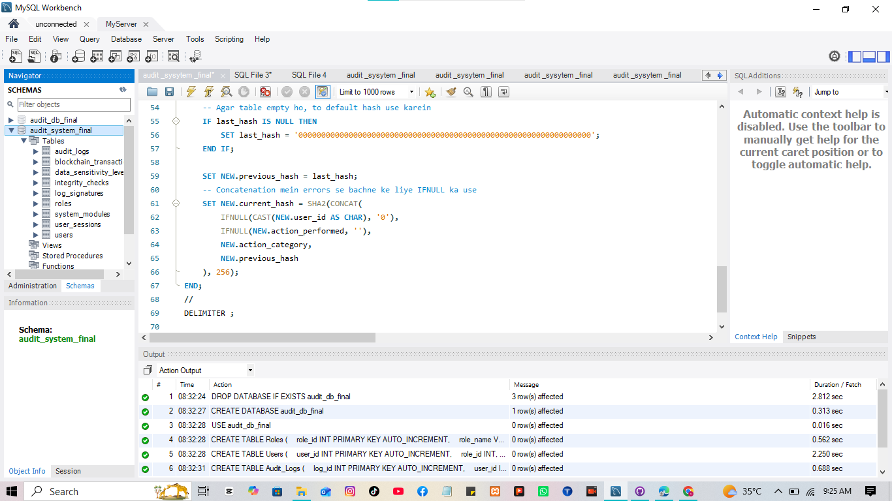

[# Secure Audit Logging Database System

An error-safe, tamper-evident MySQL database architecture featuring an immutable audit logging mechanism. By leveraging a custom trigger and SHA-256 cryptographic chaining, this system ensures the high integrity of system logs.

### Key Features:
* **Role-Based Structure:** Clean segregation of Roles, Users, and Audit Logs using `InnoDB`.
* **Blockchain-inspired Chaining:** Each new audit log entry calculates its hash based on data fields and the `previous_hash`, preventing retroactive tampering.
* **JSON Logging:** Supports structured `data_before` and `data_after` capture for detailed data history.
* **Error-Safe Trigger:** Handled edge cases (like the first insert or `NULL` values) gracefully using custom default hashes and `IFNULL` controls.
* Database: MySQL

Security: SHA-256 Cryptographic Hashing

Concepts: Database Triggers, RBAC (Role-Based Access Control), Data Integrity, Immutable Ledger.

    
  
   How to Run

1. **Run the Script:** Open the `.sql` file in MySQL Workbench and click the **Lightning Bolt (⚡)** icon to set up the database and tables.
2. **Auto-Configuration:** The script will automatically create the database (`audit_db_final`), setup tables, and activate the SHA-256 tamper-proof trigger.
3. **Verify:** Refresh your "Schemas" panel on the left to see your fully secured audit logging system ready for use!
                                               
